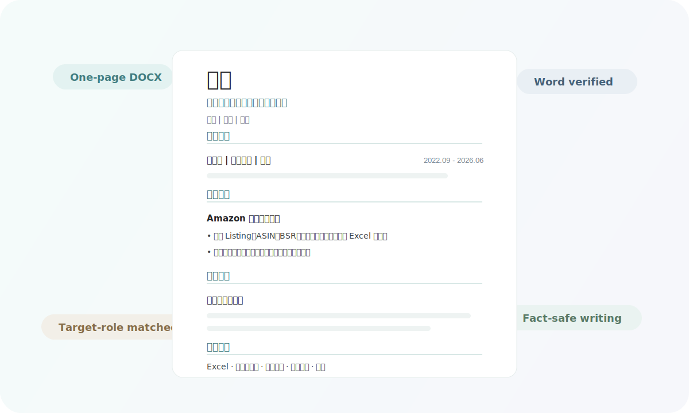
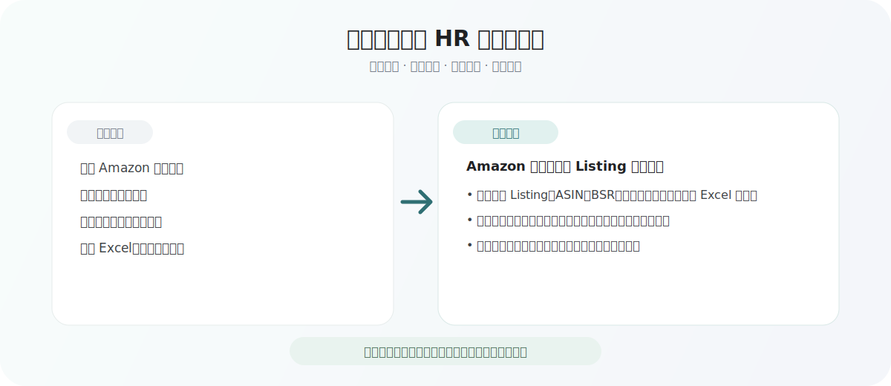

<h1 align="center">Beautiful Chinese Resume</h1>

<p align="center">
  给 Codex 用的中文简历 skill：把原始经历整理成一页、清爽、可投递的 DOCX。
</p>

<p align="center">
  
  
  
  
</p>

<p align="center">
  
</p>

---

## 为什么做这个

很多中文简历的问题不在经历本身，而在呈现方式。

有些写得像流水账，有些把所有内容塞进表格里，还有些为了显得“高级”用了太多空话。HR 看简历的时间很短，重点如果埋在下面，再好的经历也容易被扫过去。

这个 skill 只想解决一件具体的事：把用户给出的原始经历，整理成一份 **一页 A4、中文表达自然、版面干净** 的 Word 简历。

它不负责编故事，也不负责把普通经历包装成夸张成果。事实是什么，就在事实范围内写得更清楚。

<p align="center">
  
</p>

## 它会做什么

- 先看原始经历、目标岗位、目标公司和 JD。
- 把经历拆成事实：学校、项目、实习、技能、时间、工具、产出。
- 根据岗位挑重点，而不是把所有内容平均铺开。
- 把口语化表达改成简历里能用的句子。
- 生成一页中文 DOCX，不做密密麻麻的表格。
- 用 Word 打开检查，确认页数、分区和基本渲染没问题。
- 在没有 Word 的环境里，会明确说明只能做结构检查，不能确认真实页数。

原则很简单：

> 只优化表达、结构和排版，不编造经历。

## 比较适合的简历

这个 skill 更偏实习和校招简历，尤其适合这些方向：

| 方向 | 常见关键词 |
| --- | --- |
| 跨境电商运营实习 | Amazon、Listing、ASIN、BSR、竞品调研、Excel |
| 内容运营实习 | 文案、选题、内容排期、账号维护、数据复盘 |
| 数据/运营助理 | 表格维护、数据清洗、指标跟踪、周报、SOP |
| 校招/实习投递 | 教育背景、项目经历、实习经历、技能证书 |

它不会硬塞关键词。只有当用户的经历能支撑这些词时，才会自然放进去。

## 现在的边界

这个项目更像一个可用的 Codex 简历 skill，不是完整的商业简历平台。

- 更适合中文实习、校招和运营/电商方向。
- 英文简历、技术岗、高管岗、设计作品集还没专门优化。
- 内容强弱判断主要还是由 Codex 根据 `SKILL.md` 和参考规则完成。
- `scripts/build_resume_docx.py` 负责稳定排版，不负责自动发明内容。
- Word 页数检查依赖 Windows + Microsoft Word；Mac/Linux 上只能做结构检查。

## 生成出来应该是什么感觉

不是花哨模板，也不是满屏表格。默认会往这个方向做：

- 顶部能看清姓名、求职方向和联系方式。
- 分区清楚：教育背景、项目经历、实习经历、技能证书。
- 字号不要太小，内容不要挤。
- 用一点浅色分割线和强调色，但不抢内容。
- 重要经历放前面，弱相关内容能压就压。
- 如果内容超出一页，优先删弱项，不靠极小字号硬塞。

## 安装

把仓库放到 Codex 的 skills 目录：

```powershell
git clone https://github.com/hao0401/beautiful-chinese-resume.git "$env:USERPROFILE\.codex\skills\beautiful-chinese-resume"
```

然后重启 Codex。

如果只想试脚本，可以先装依赖：

```powershell
python -m pip install -e ".[test]"
```

## 怎么用

在 Codex 里直接说：

```text
使用 beautiful-chinese-resume，帮我生成一页中文 DOCX 简历。

目标公司：XXX
目标岗位：跨境电商运营实习生
岗位 JD：……
原始经历：……
```

英文触发也可以：

```text
Use $beautiful-chinese-resume to create a one-page Chinese DOCX resume from my raw experience, target company, and target role.
```

## 大致流程


<details>
<summary><strong>项目结构</strong></summary>

```text
beautiful-chinese-resume/
├─ SKILL.md
├─ agents/
│  └─ openai.yaml
├─ assets/
│  ├─ readme-before-after.svg
│  └─ readme-preview.svg
├─ examples/
│  └─ sample_resume.json
├─ references/
│  ├─ content-rules.md
│  ├─ layout-rules.md
│  └─ targeting-keywords.md
├─ tests/
│  ├─ test_resume_scripts.py
│  └─ test_skill_metadata.py
└─ scripts/
   ├─ build_resume_docx.py
   ├─ validate_skill.py
   └─ verify_resume_docx.py
```

</details>

<details>
<summary><strong>脚本用法</strong></summary>

从结构化 JSON 生成中文 DOCX：

```powershell
python .\scripts\build_resume_docx.py .\examples\sample_resume.json .\sample.docx --style campus
```

查看已有样式：

```powershell
python .\scripts\build_resume_docx.py --list-styles
```

检查 DOCX：

```powershell
python .\scripts\verify_resume_docx.py .\sample.docx --expect-one-page
```

检查内容包括 Word 是否能打开、页数是否为一页、核心分区是否存在，以及目标岗位关键词是否自然出现。

本地测试：

```powershell
python -m pytest
```

</details>

## License

MIT
